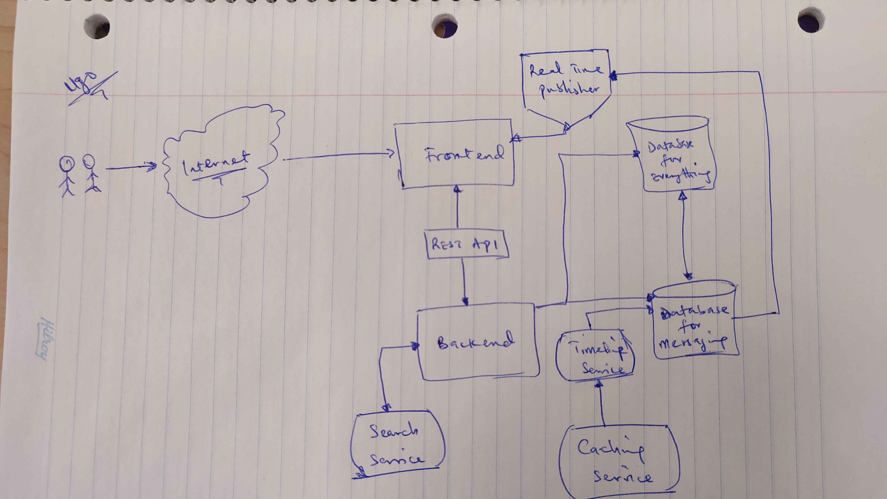
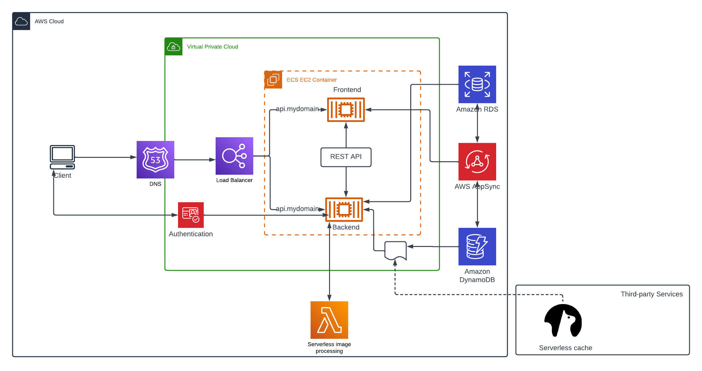
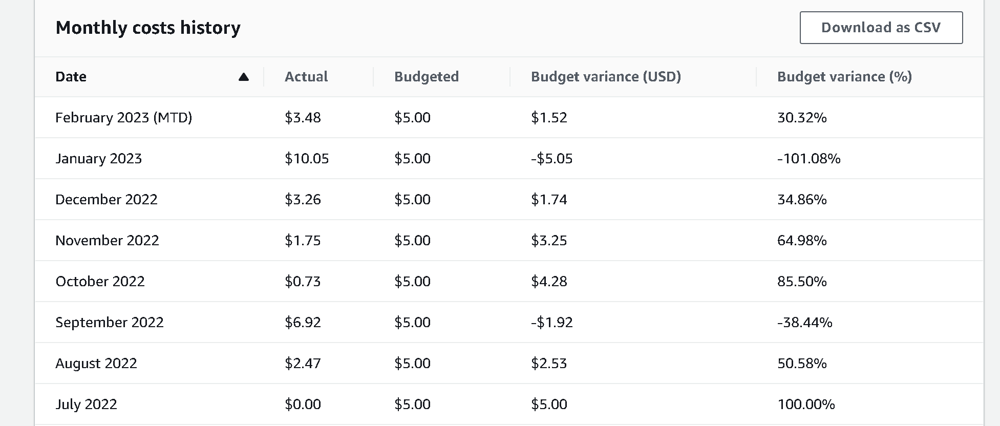
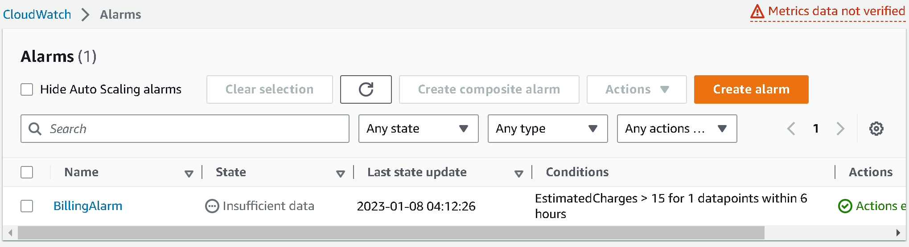

# Week 0 — Billing and Architecture

## Required Homework

### Conceptual Diagram on a Napkin

### Logical Architectual Diagram in Lucid Charts

[Link to lucid chart diagram](https://lucid.app/lucidchart/e7f75a97-7caa-48ce-83a0-2bcb20bb2e5a/edit?viewport_loc=-2543%2C-1004%2C2997%2C1530%2C0_0&invitationId=inv_c2170e6c-c8e4-4299-9ccb-5b992f96f24a)

### AWS Credentials and CLI
I already use the AWS CLI and credentials for deploying infrastructure in terraform from my Windows and Linux computers. I followed the bootcamp videos to set up AWS CLI in gitpod for use in the project.

### Budget and billing notifications set up
I already have a budget set up on the account I'm using for the bootcamp some months back for use on person experimental projects. I attached proof of the running budget below. 

I also followed the bootcanp videos to learn how to set up budget and billing alarms + notifications using the CLI, I modified the json files but did not apply them to have duplicating the budgets.
